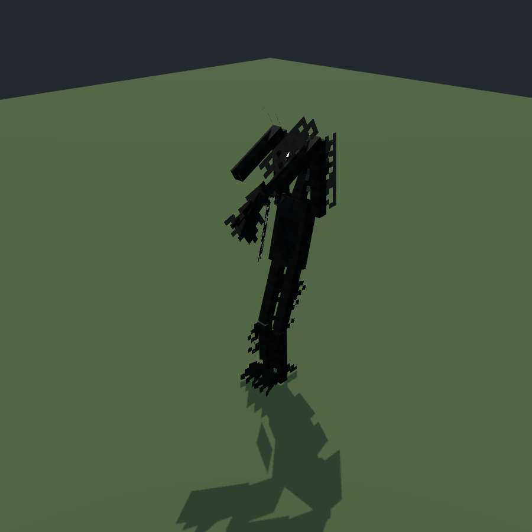
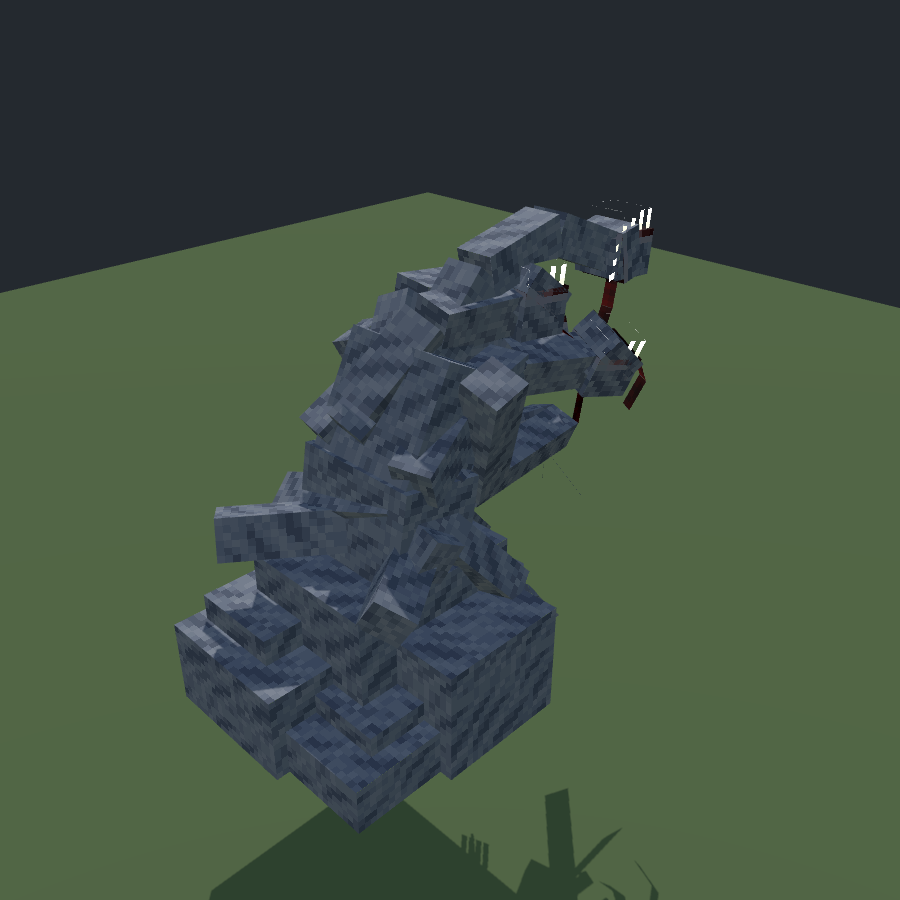
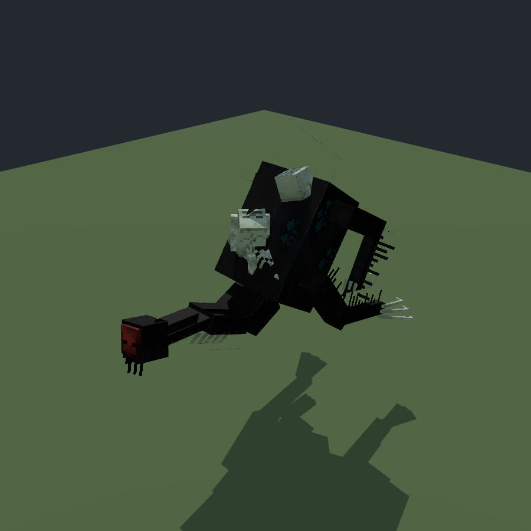
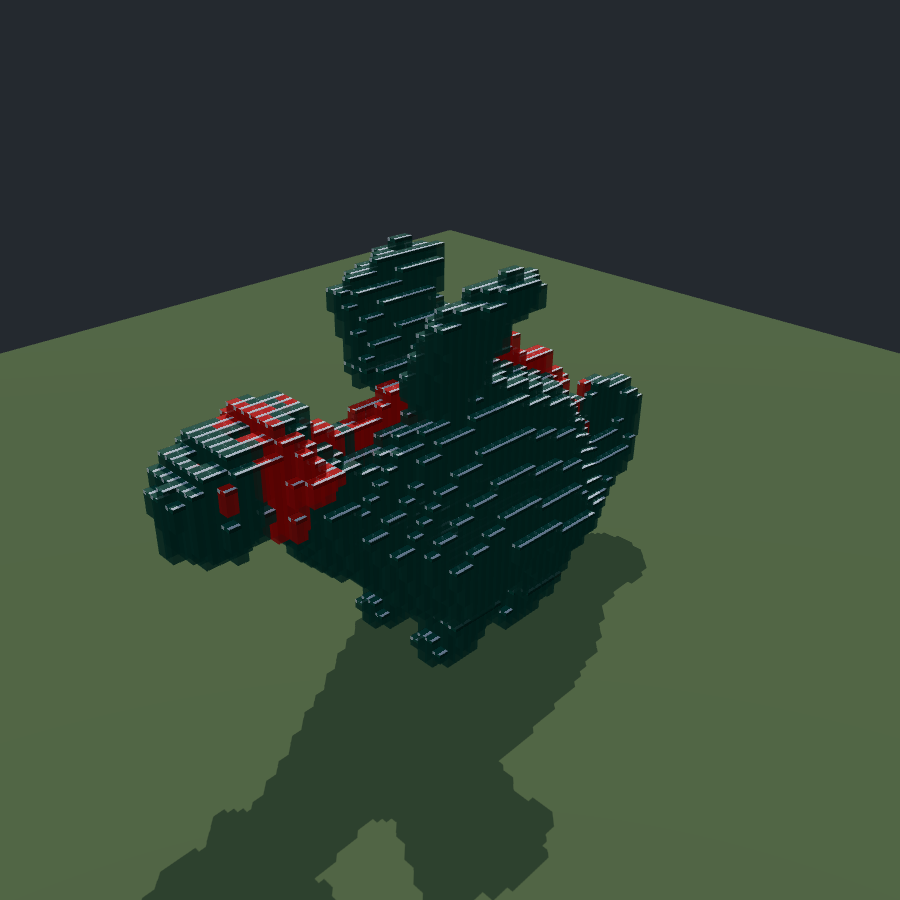
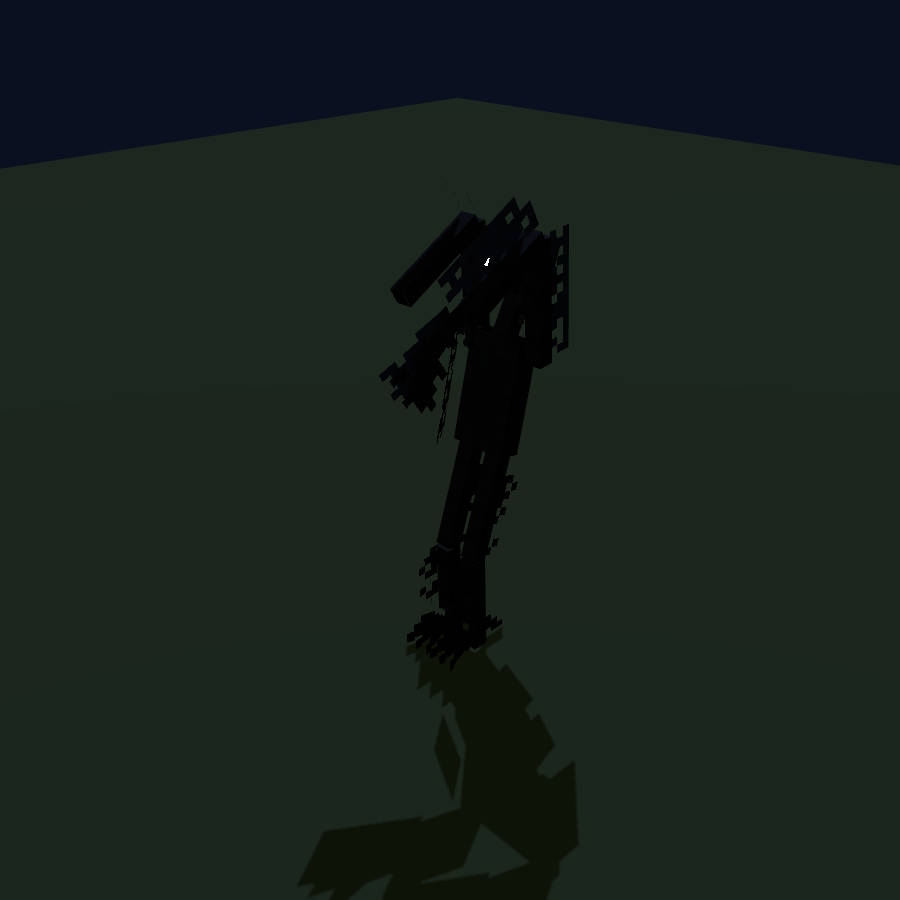
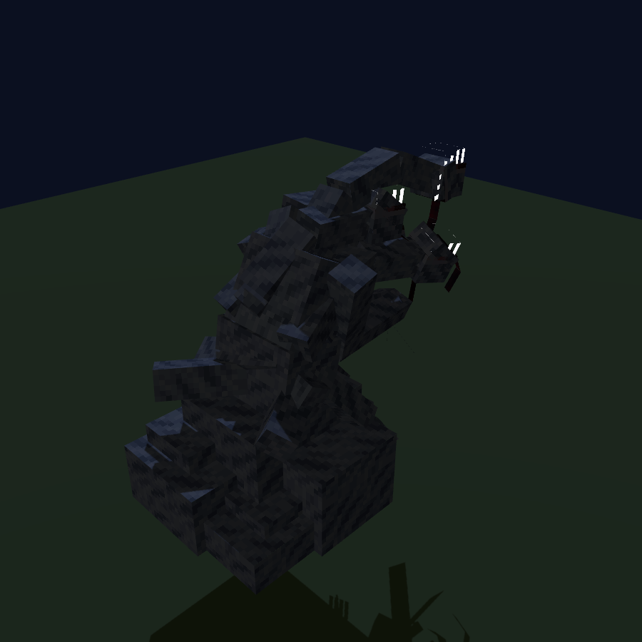
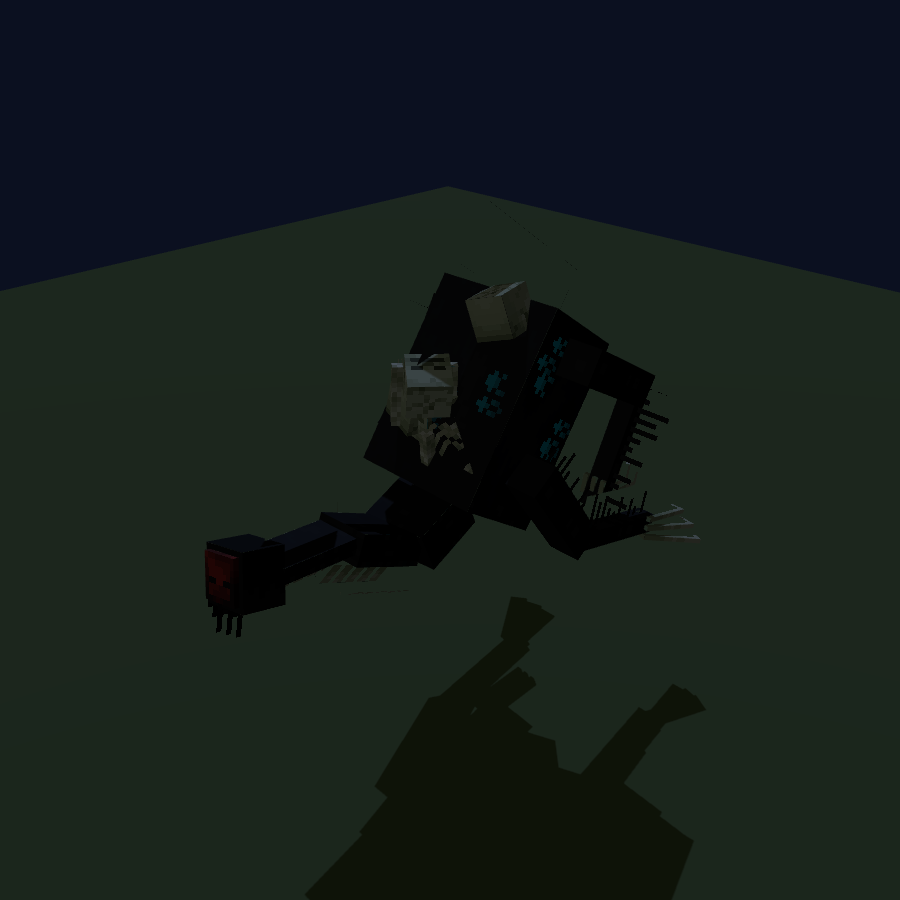
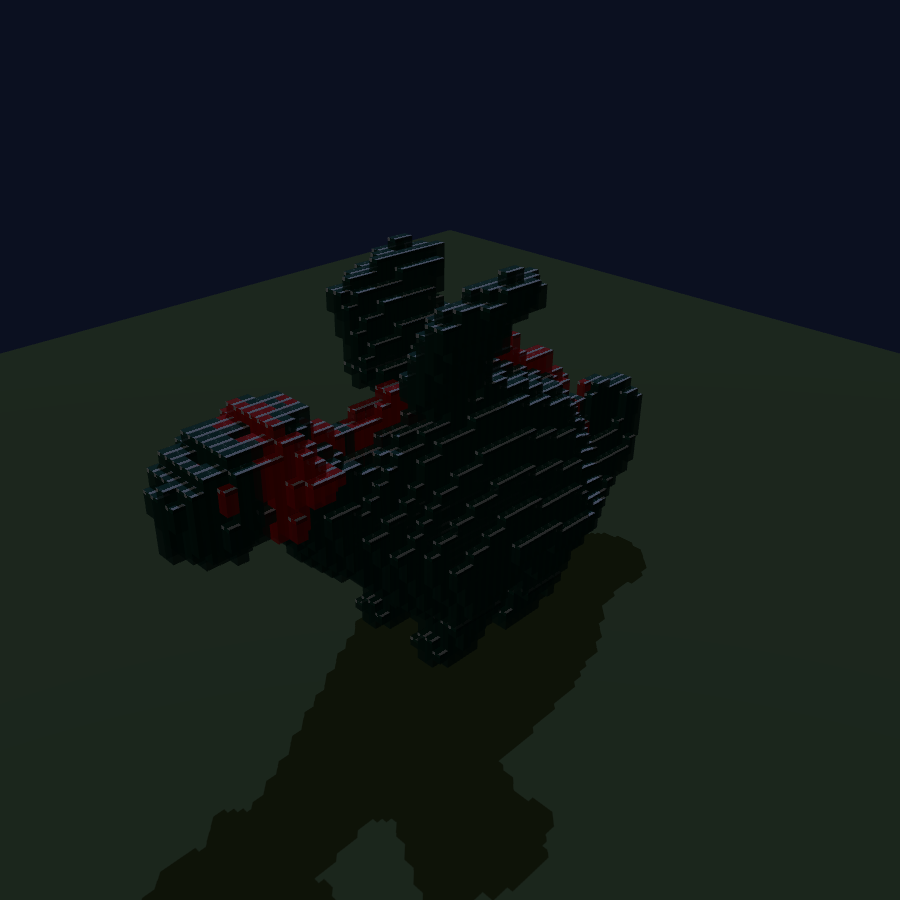

# 🧊 Freebuff Mob Studio

[](preview.html)
[](js/mobs/library.js)
[](.github/workflows/ci.yml)
[](LICENSE)

Webissä toimiva 3D-editori Minecraft-mobien tekemiseen (Blockbenchin tyyliin).
Mobi rakennetaan kuutioista, luurangosta ja väreistä, ja se viedään suoraan
Bedrock-geometriana tai Java Edition -modin resurssipakettina.

## Ominaisuudet

- 🟦 **3D-näkymä** (Three.js) — kierto, zoom ja pan
- 🧱 **Kuutioeditointi** — lisää, muokkaa, kopioi ja poista kuutioita
- 🦴 **Luuranko** — bone-hierarkia nivelöintiä varten. Valitse luu ja kierrä sitä
- 🧬 **Osat (Spore)** — 22 valmista osaa (jalat, kädet, päät, hännät, siivet,
  selkäpiikit, korvat). Kiinnitysdialogissa valitaan luu, pinta
  (alas/ylös/eteen/taakse/sivu) ja peilaus. Kiinnitettyä osaa voi skaalata,
  kiertää ja värittää kiinnityspisteensä ympäri, ja poistaa kokonaan
  (peilipuoli mukana)
- 🎲 **Randomize** — rakentaa satunnaisen olennon osista: jokaiselle osalle
  arvotaan luu, pinta, peilaus ja väri. Olento saa nimen (Mörökölli,
  Piikkisydän…) ja idle/walk/attack-animaatiot valmiina. ⌘Z palauttaa
  edellisen mallin, uusi klikkaus rakentaa aina uuden
- 💾 **Omat olennot** — kirjaston oma välilehti, johon rakennetut olennot
  tallennetaan nimellä, emojilla ja stateilla (HP, vahinko, nopeus,
  animaatiot, tekstuuri). Lataus takaisin editoriin milloin vain
- 🎨 **Väri = tekstuuri** — kuution väri täyttää sen kasvot tekstuuriin
  automaattisesti, joten tekstuuria ei tarvitse piirtää erikseen
- ✨ **Emissiivinen glow** — mobin oma glow-kerros (esim. `maniac_glow.png`)
  toimii emissiivisenä karttana, joten silmät hohtavat valaistuksesta
  riippumatta. False Hydran hehku johdetaan tekstuurin kirkkaista pikseleistä
- 🖌️ **UV-editori** — kasvojen siirto, täyttö ja pensselimaalaus, valmiit
  Minecraft-paletit (ihonsävyt, villat, luonto) sekä omat värit
- 🎬 **Animaatio** — keyframe-timeline ja poseeraus suoraan 3D:ssä,
  copy/paste/mirror pose. Mobi voi tuoda useita animaatioita (idle/walk/attack)
- 🕺 **Auto-animaatiot** — luurangosta generoidaan idle/walk/attack (ja
  fly/swim jos siivet tai evät). Walk on oikea askellus: jalka maassa,
  vartalo kohoaa, pää nyökkää
- 🔍 **Mob-kirjasto** — 143 mobia: 59 oikeaa vanilja-mobia, 72 Deep Void
  -otusta (modin oikeat assetit, MIT-lisenssi) ja 11 vokseloitua eläintä.
  Haku, lajittelu (isoimmat ensin), kokoluokka- ja Deep Void -suodattimet,
  bossi/minioni-ryhmittely
- 📊 **Bossi-statit** — HP, kyvyt ja kutsuminen purettu Deep Void 1.98.1
  -JARin bytecodesta, ei arvauksia: False Hydra 600 HP, Weaver of Souls
  500 HP, Apostle of Catastrophe 720 HP…
- 🦊 **Voxel-eläimet** — oikeat CC0-eläinmallit muutetaan neliöiksi:
  lohikäärme, karhu, susi, leijona, tiikeri, dinosaurus… Lajikohtaiset
  paletit tuovat oikeat värit (tiikerin raidat ja valkoinen vatsa,
  leijonan harja, suden vaalea alavatsa). Jokainen saa automaattisesti
  luurangon ja kävely/lento-animaation
- 📦 **Vokseloi oma malli** — vedä .glb tai .obj selaimessa auki, niin se
  vokseloituu ja latautuu kirjastoon
- 🪞 **Peilaus ja symmetria** — mirror copy, symmetria-editointi (muokkaat
  toista puolta, toinen peilautuu livenä) ja peilattu maalaus
- 🖌️ **3D-maalaus** — maalaa suoraan mallin pintaan; väripipetti poimii
  värin pinnasta
- 🎮 **Game Preview** — pelin näköinen esikatselu (Minecraft-valaistus,
  varjot, glow) päällä automaattisesti mobia ladattaessa. Yötila näyttää,
  miltä hehku näyttää pimeässä
- 📦 **Resurssipaketti** — valmis .zip tai .mcaddon: malli, tekstuurit,
  animaatiot ja behavior-pack (HP, vahinko, käytös, spawn-säännöt).
  Bedrock-paketti toimii suoraan Minecraftissa — animaatio pyörii ja glow
  hehkuu. Java-paketissa on GeckoLib-ohje ja datapakki summon-funktioineen
- ✅ **Laatuvarmentajat** — `npm run verify:*` tarkistaa UV-asettelun,
  render- ja data-vastaavuuden sekä sen, etteivät animaatiot uppoa lattiaan
- 🤝 **Osallistuminen** — mob-muutoksen yhteydessä Esimerkkejä-kuvat pitää
  päivittää (`node tools/export-example-shots.mjs --all`), muuten
  toistettavuusportti ei läpäise. Katso [CONTRIBUTING.md](CONTRIBUTING.md).

## Esimerkkejä

<p>
  
  
  
  
</p>

Yötilassa emissiivinen glow pääsee oikeuksiinsa:

<p>
  
  
  
  
</p>

Kuvat renderöi `node tools/export-example-shots.mjs --all` (headless Chrome, sama renderöintiprosessi kuin editorissa). Koko kirjaston galleria (kaikki 143 mobia): `node tools/export-example-shots.mjs --library` → [examples/gallery/](examples/gallery/index.html).

## Käyttö

```bash
npm install            # three.js + esbuild (kerran)
npm start              # kehityspalvelin: http://localhost:8080
npm run build:preview  # tekee itsenäisen preview.html:n
```

`preview.html` on täysin itsenäinen (kaikki bundlattu yhteen tiedostoon), joten
sen voi avata suoraan kaksoisklikkauksella ilman palvelinta.

## Näppäimet

| Näppäin | Toiminto |
|---------|----------|
| `S` | Valintatyökalu |
| `G` | Siirto (move) |
| `R` | Kierto (rotate) |
| `Delete` | Poista valittu |
| `Ctrl+D` | Kopioi valittu kuutio |
| `Ctrl+Z` / `Ctrl+Y` | Undo / Redo |
| `Space` | Animaation play/pause |

## Tiedostorakenne

```
index.html              — pääsivu
style.css               — tyylit
js/main.js              — sovelluslogiikka ja 3D-näkymä
js/uv-editor.js         — 2D UV-editori
js/animation.js         — animaatio-timeline ja keyframet
js/mobs/library.js      — mob-kirjasto
js/mobs/vanilla.js      — vanilja-mobit (generoitu)
js/mobs/deepvoid.js     — Deep Void -hahmot (generoitu)
js/mobs/voxel.js        — vokseloidut eläimet (generoitu)
js/mobs/parts.js        — Spore-osat
js/mobs/stats.js        — bossi-statit (generoitu bytecodesta)
js/formats/             — Bedrock/Java/Blockbench import ja export
js/utils/               — historia, UV-laskenta, pakkaus, autosave ym.
assets/vanilla/         — vanilja-assetit (tools/generate-vanilla.js)
assets/deepvoid/        — Deep Void -assetit (tools/generate-weaver.js)
tools/                  — generaattorit ja varmentajat
docs/                   — tutkimus ja referenssit
```

## Vanilla-assetit

`npm run fetch:vanilla` lataa mobien geometriat, tekstuurit ja animaatiot
Mojangin `bedrock-samples`-reposta, konvertoi TGA→PNG ja regeneroi
`js/mobs/vanilla.js`. Uusi mobi kirjastoon = yksi rivi `MOB_CONFIG`iin
`tools/generate-vanilla.js`-tiedostossa.

Oikeat keyframe-animaatiot (esim. lampaan laidunnus, wardenin roar/attack)
tulevat valitsimeen sellaisinaan. Proseduraaliset MoLang-animaatiot
korvataan generaattorin kävelysyklillä.

## Deep Void -bossit

Kirjastossa on 72 otusta The Deep Void -modista (MIT) oikeine geometrioineen,
tekstuureineen ja animaatioineen. Isompia ja pienempiä: Stalker, Weaver of
Souls, Chained Weaver, False Hydra (107 luuta), Apostle of Catastrophe,
Eye Centipede, Hive Watcher, Soulseeker, Alpha Bone Crawler, Death Maw,
Giant Shadow Hand… Kaikki mobit, joilla pelissä on glow-kerros, hehkuvat
myös editorissa (kerros on varmistettu modin layer-luokista).

Bossi-statit (HP, kyvyt, kutsuminen) on purettu suoraan JARin
`.class`-tiedostoista: `createAttributes` → HP ja nopeus, `registerGoals` →
AI-kyvyt, `lang/en_us.json` → rekisteri-id:t. Parserit ovat
`tools/`-hakemistossa, generoitu data `js/mobs/stats.js`.

## Tutkimus & referenssit

- [docs/research.md](docs/research.md) — Deep Void -tyyliset modpäkit,
  boss-modit ja entiteettidatan lähteet
- [docs/bedrock-entity-reference.md](docs/bedrock-entity-reference.md) —
  Bedrock-bossin rakenne datana (Mojang/bedrock-samples)
- [docs/meetyourfight-analysis.md](docs/meetyourfight-analysis.md) —
  MeetYourFight-bossimodin koodianalyysi
- [docs/build-and-ci.md](docs/build-and-ci.md) — miten preview.html
  rakennetaan ja mitä CI:n badgejen takana on

## Lisenssi

Oma koodi on MIT-lisenssillä — katso [LICENSE](LICENSE).

Kirjaston assetit ovat eri lähteistä:

- Deep Void -modin mobit (geometria, tekstuurit, animaatiot) — modin
  MIT-lisenssi
- Vanilja-mobit — Mojangin Minecraft EULA
- Vokseloidut eläinmallit — CC0
